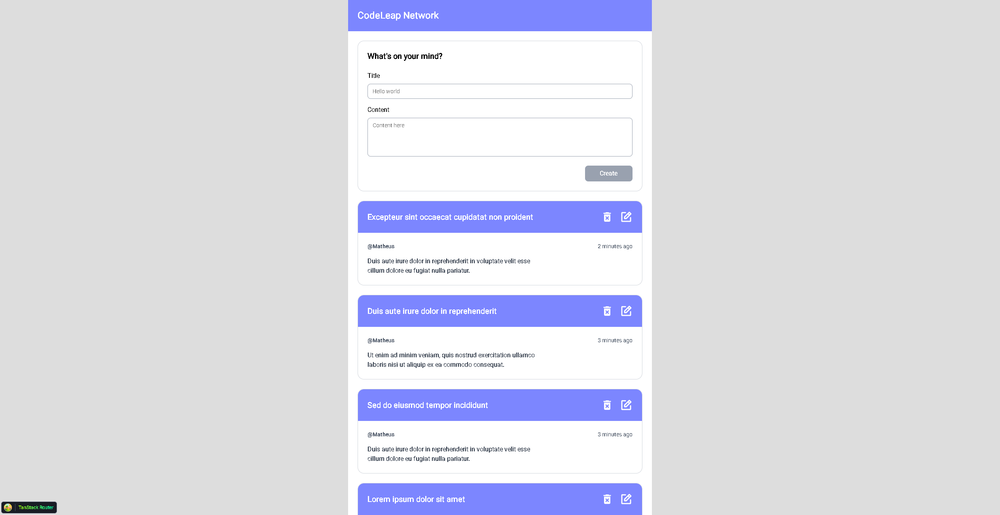

# CodeLeap Network




A modern social media application built with React, TypeScript, and Vite. Users can share posts, interact with content, and manage their contributions in a clean, responsive interface.

## 🚀 Features

- **User Authentication**: Simple username-based login system with localStorage persistence
- **Post Management**: Create, read, update, and delete posts (CRUD operations)
- **Real-time Timestamps**: Dynamic "time ago" display that updates every minute (e.g., "5 minutes ago", "2 hours ago")
- **User-specific Actions**: Edit and delete buttons only visible for posts created by the logged-in user
- **Form Validation**: Client-side validation using Zod schemas with React Hook Form
- **Responsive Design**: Mobile-first design with Tailwind CSS
- **Modal Interactions**: Dedicated modals for edit and delete confirmations
- **API Integration**: RESTful API communication using Axios

## 🛠️ Tech Stack

- **React 19**: Latest React with hooks and modern patterns
- **TypeScript**: Full type safety and better developer experience
- **Vite**: Lightning-fast build tool and development server
- **TanStack Router**: Type-safe routing solution
- **React Hook Form**: Performant form handling with minimal re-renders
- **Zod**: Schema validation for forms and data
- **Tailwind CSS 4**: Utility-first CSS framework
- **Axios**: Promise-based HTTP client
- **React Icons**: Popular icon library

## 📦 Installation

```bash
# Install dependencies
npm install

# Start development server
npm run dev

# Build for production
npm run build

# Preview production build
npm run preview

# Run linter
npm run lint
```

## 🏗️ Project Structure

```
src/
├── components/          # Reusable UI components
│   ├── ModalDeleteComponent.tsx
│   ├── ModalEditComponent.tsx
│   └── PostCardComponent.tsx
├── routes/             # Route components
│   ├── __root.tsx
│   ├── index.tsx       # Login/welcome page
│   └── posts.tsx       # Main posts feed
├── services/           # API service layer
│   ├── api.ts          # Axios instance configuration
│   └── posts.ts        # Post-related API calls
├── utils/              # Utility functions
│   └── time.ts         # Time formatting helpers
└── main.tsx           # Application entry point
```

## 🎯 Key Concepts Demonstrated

- **Component Composition**: Modular components with clear responsibilities
- **Custom Hooks**: React hooks for state management and side effects
- **Type Safety**: Comprehensive TypeScript types and interfaces
- **Form Validation**: Schema-based validation with Zod
- **Optimistic Updates**: State management patterns for better UX
- **Memoization**: Performance optimization with useMemo
- **Clean Architecture**: Separation of concerns between UI, logic, and data layers

## 🌐 API Integration

The application connects to the CodeLeap API at `https://dev.codeleap.co.uk/careers/`

### Available Endpoints:
- `GET /` - Fetch all posts
- `POST /` - Create a new post
- `PATCH /{id}/` - Update an existing post
- `DELETE /{id}/` - Delete a post

## 💡 Usage

1. **Login**: Enter a username (minimum 3 characters) on the welcome page
2. **Create Post**: Fill in the title and content fields, then click "Create"
3. **View Posts**: Scroll through the feed to see all posts with timestamps
4. **Edit Post**: Click the edit icon on your own posts to modify them
5. **Delete Post**: Click the delete icon and confirm to remove your posts

## 🔧 Development Notes

- The application uses localStorage to persist the username
- Posts automatically refresh after create/update/delete operations
- Timestamps update every 60 seconds without requiring a page refresh
- Form validation provides real-time feedback as users type

## 📝 License

This project was created as a technical assessment for CodeLeap.

## 🧑🏾‍💻 Author
Matheus Gomes de Souza  
LinkedIn: https://www.linkedin.com/in/matheus-gomes-de-souza/  
E-mail: matheusg_souza@outlook.com
